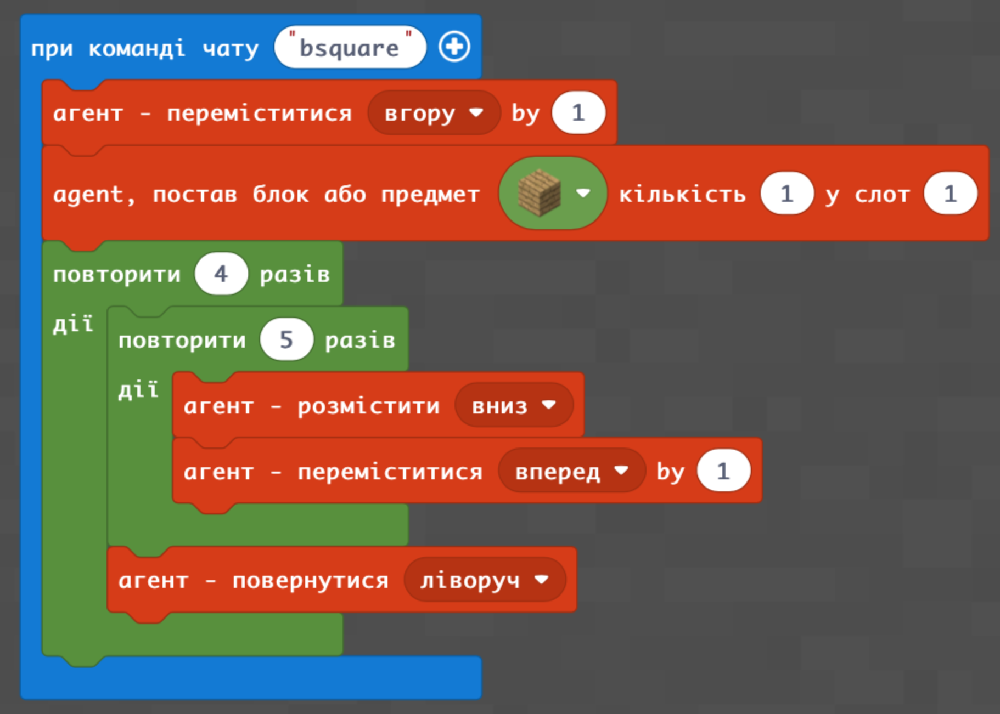
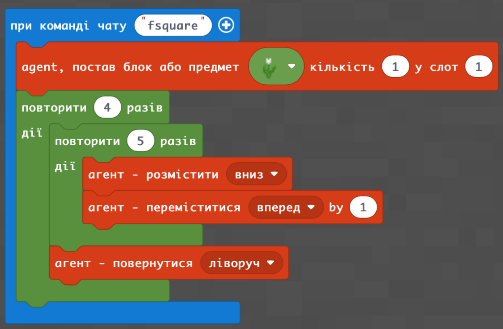

# Перші побудови в Minecraft Education

#### **Опис**


Сьогодні ми попрактикуємо навички управління агентом. Створимо квадрат і прямокутник блоків та квітів. Згадаємо шкільну математику та розрахуємо периметр і площу для всіх побудованих квадратів і прямокутників.


## Згадаймо🤔

1. Хто такий агент і як ним керувати?
2. Що таке азбука Морзе і хто такий Морзе?

## Сьогодні ми:

1. Навчимось створювати квадрати різних розмірів із блоків.
2. Навчимось створювати квадрати різних розмірів із квітів.
3. Навчимось створювати прямокутники різних розмірів із блоків.
4. Навчимось створювати прямокутники різних розмірів із квітів.
5. Розрахуємо площу всіх наших будівель.

## Сюрприз🤩

Потренуймося використувати готовий код, надісланий іншими користувачами.&#x20;

Відкрийте код [«СЮРПРИЗ»](https://makecode.com/\_HVr9HjH4yFpf) та виконайте його

https://makecode.com/\_HVr9HjH4yFpf

Що вийшло?🤔

## Основні завдання

**Спробуйте самостійно написати код, де Агент будує із блоків квадрат 4х4**

| **Назва**     | **Квадрат блоків**                                                                                                                                                                                                                                                                                            | **Квадрат квітів**                                                                                         |
| ------------- | ------------------------------------------------------------------------------------------------------------------------------------------------------------------------------------------------------------------------------------------------------------------------------------------------------------- | ---------------------------------------------------------------------------------------------------------- |
| **Завдання**  | 
– квадрат 7х7 

– квадрат 3х3 

– квадрат 4х4 

– квадрат 10х10

– квадрат 20х20
                                                                                                                                                                                                   | 
– квадрат 7х7 

– квадрат 3х3 

– квадрат 4х4

– квадрат 10х10

– квадрат 20х20
 |
| **Код**       | 
 або 
 |                                                                                |
| **Результат** | .png>)                                                                                                                                                                                                                                                                         | .png>)                                                                       |


Якщо ви впорались із усіма основними завданнями, перейдіть до додаткового. Його виконання дозволить вам вдосконалити набуті навички!


## Додаткове завдання

1. Розрахуйте периметр і площу для всіх побудованих квадратів та прямокутників (це обов'язково знадобиться вам на уроці математики😉).\

2. Побудуйте відповідні квадрати.

<figure><figcaption></figcaption></figure>

| **Завдання**  | 
Побудуйте квадрати зі сторонами:
<ol><li>6 см</li><li>7 см</li><li>8 см</li></ol> |
| ------------- | --------------------------------------------------------------------------------------- |
| **Код**       | .png>)                                                    |
| **Результат** | .png>)                                                    |

3\. Побудуйте відповідні прямокутники.

| **Завдання**  | 
Побудуйте прямокутники зі сторонами:

 1. 3×7

2. 4×9

3. 6×8

4. 6×13
 |
| ------------- | ---------------------------------------------------------------------------------------------------- |
| **Код**       | .png>)                                                                 |
| **Результат** | .png>)                                                                 |

4\. Побудуйте відповідні фігури.

|                                      |
| ------------------------------------ |
| .png>) |
| .png>) |

## Додаткове завдання

1. Побудувати квадрат з квітів зі стороною 10 квіток&#x20;
2. Побудувати одним кодом два такі квадрати&#x20;
3. Побудувати одним кодом два квадрати: маленький всередині великого

## [ «Лавове озеро»](https://makecode.com/\_41yJza0zH2Ku)

| **Завдання**  | Побудувати «Лавове озеро» під землю                                                                                                                                                                                                                                                                                                                                                                                                                                                                           |
| ------------- | ------------------------------------------------------------------------------------------------------------------------------------------------------------------------------------------------------------------------------------------------------------------------------------------------------------------------------------------------------------------------------------------------------------------------------------------------------------------------------------------------------------- |
| **Код**       | 
 
 |
| **Результат** |                                                                                                                                                                                                                                                                       |

## Ферма

| **Завдання**  | Створити ферму                                                                                                                                                                                                                           |
| ------------- | ---------------------------------------------------------------------------------------------------------------------------------------------------------------------------------------------------------------------------------------- |
| **Код**       |  |
| **Результат** |  |

## **Змійка**

| **Завдання**  | Створити змійку                                                                                                                                                                                                                             |
| ------------- | ------------------------------------------------------------------------------------------------------------------------------------------------------------------------------------------------------------------------------------------- |
| **Код**       |  |
| **Результат** |    |

## Творче завдання

Виміряйте розмір вашої кімнати та зробіть фігуру в Майнкрафті, що відповідає формі кімнати за умови, що 1 блок дорівнює 10 см вашої кімнати.

## **Домашнє завдання**

### Завдання 1&#x20;

Виміряйте розмір вашої кімнати та зробіть фігуру в Майнкрафті, що відповідає формі кімнати за умови, що 1 блок дорівнює 10 см вашої кімнати.

### Завдання 2

Кодом побудувати квадратний (або прямокутний) басейн і залити його водою або лавою — це все робить Агент.&#x20;

### Завдання 3 (додаткове, хто любить складні)&#x20;

Ускладнити код басейну, щоб біля нього були посаджені рослини та стояли блоки з підсвіткою (на ваш смак).

### Завдання 4 (додаткове)

Написати програму, яка виводить на екран відповіді після обчислення **периметру** вашої кімнати та її **площі**.

### Завдання 5

Код опублікуйте в Schoolodgy як[ тут](https://youtu.be/KW4fCTlCnf8)


На наступному занятті на вас чекає подорож до Стародавнього Єгипту та побудова піраміди! Також ви отримаєте навички, необхідні для вашого проєкту😉

